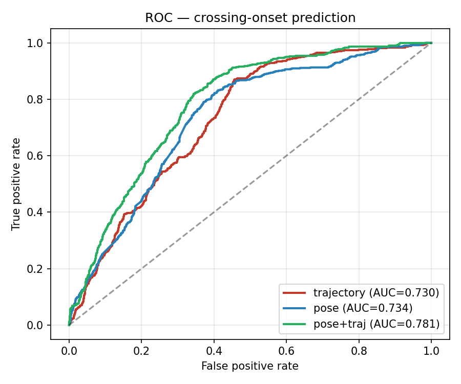
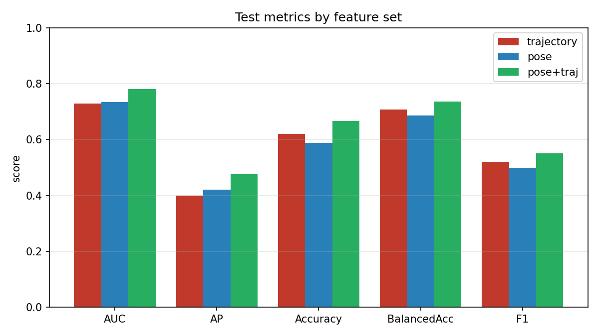
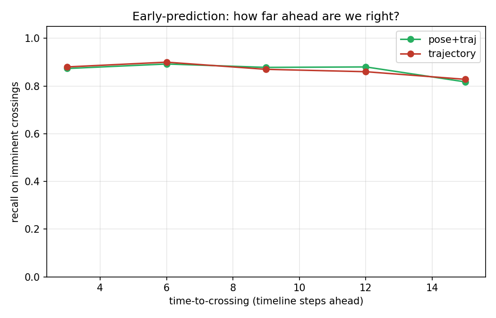
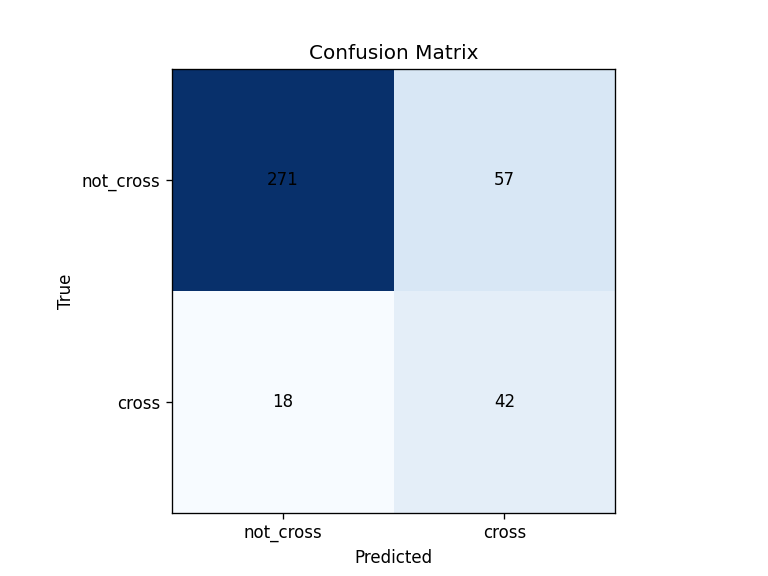
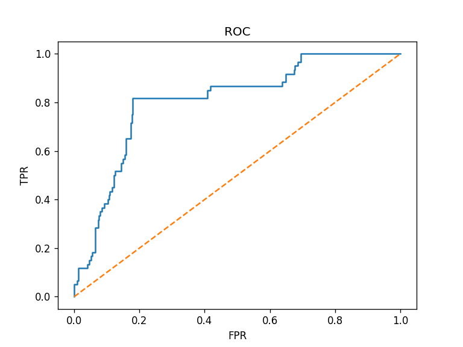
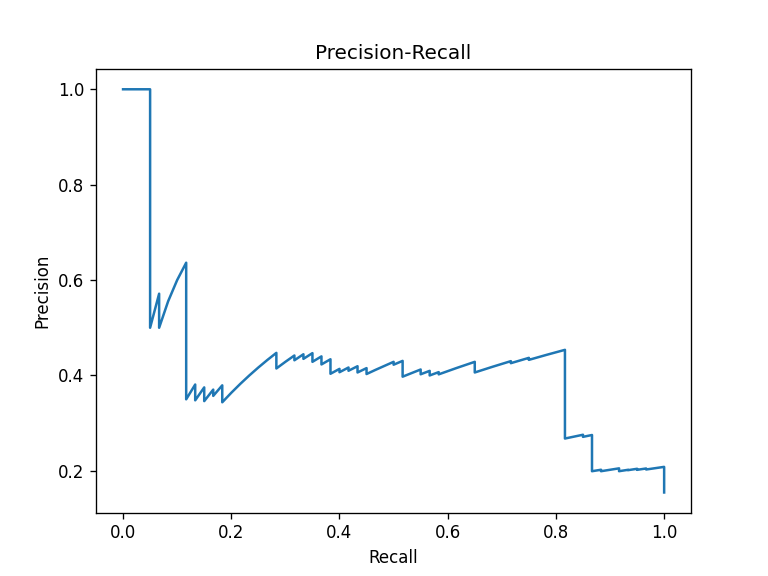
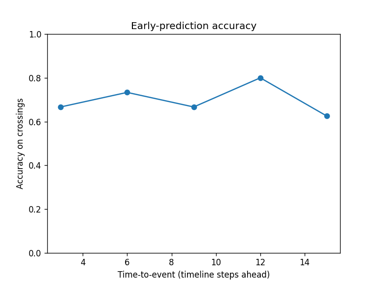

# 🚗 ADAS Pedestrian Crossing-Intent Prediction


A real-time perception pipeline that **predicts whether a pedestrian is about to cross ~1.5 s ahead** — not just reacting to current motion — by fusing body-pose and trajectory in a leak-free temporal model. Pose + trajectory fusion lifts crossing-onset **ROC-AUC from 0.730 → 0.781** over a trajectory-only baseline (5-fold cross-validation on 150 JAAD videos) and more than halves fold-to-fold variance.

The full system ingests dashcam or surveillance video, detects and tracks road agents (RT-DETR + ByteTrack), estimates pose, predicts crossing intent, scores danger, and renders annotated video — all through a live FastAPI web UI. Modular, checkpointed, and resumable.

---

## 📌 Overview

This project began as `intent_fusion.py`, a prototype that ran YOLOv8 on dashcam clips to flag *currently* moving pedestrians. It has since become a production-style pipeline whose core capability is **prediction, not reaction** — anticipating a crossing before it happens, which is the event that actually matters for an ADAS warning. Modular, resumable, and multi-output.

**Input:** Raw dashcam video or JAAD dataset clips  
**Output:** Annotated MP4 video · `dataset.json` · `dataset.csv` · PASCAL VOC XML annotations

---

## 🏗️ Architecture

```
Input Video / JAAD Dataset
        │
        ▼
┌──────────────────────────────────────────┐
│         PipelineRunner (orchestrator)    │
│  · Runs 10 stages in sequence            │
│  · Checkpoints after each stage          │
│  · Supports resume on failure            │
└──────────────────────────────────────────┘
        │
        ▼
   1. input_handler      → validate video / JAAD XML
   2. frame_extractor    → extract JPG frames (every Nth)
   3. frame_cleaner      → remove blurry / dark / corrupt frames
   4. detector           → RT-DETR bounding boxes (transformer; YOLO selectable)
   5. tracker            → assign consistent track IDs (ByteTrack / IoU)
   6. pose_estimator     → 17-keypoint skeleton + body-language features
   7. behavior_analyzer  → classify motion (walking / crossing / running / driving / stopping)
   8. intent_predictor   → crossing-intent PREDICTION from pose + trajectory
   9. tagger             → compute danger_score + DANGER/SAFE scene tag
  10. exporter           → write dataset.json + dataset.csv
        │
        ▼
   visualizer.py         → render annotated MP4 (H.264)
   xml_exporter.py       → PASCAL VOC XML annotations
```

> **What changed vs the original pipeline.** The system no longer just *tracks*
> and reacts to motion — it *predicts* whether each pedestrian is about to cross,
> from body posture (lean, head/gaze turn, stance, gait, foot placement) fused
> with trajectory, using a leak-free observe→predict temporal model. The detector
> was upgraded from YOLOv8 to RT-DETR (a transformer detector). See
> **Crossing-Intent Prediction** below.

---

## 🔬 Pipeline Stages

| # | Stage | Description |
|---|-------|-------------|
| 1 | **input_handler** | Validates codec, dimensions, frame count; parses JAAD XML for intent labels |
| 2 | **frame_extractor** | Samples every Nth frame (default: 5), saves JPEGs to `output/frames/` |
| 3 | **frame_cleaner** | Drops corrupt (>95% solid), blurry, dark (mean < 40), and near-duplicate frames, then denoises + CLAHE-normalises survivors. **Blur threshold is adaptive**: it samples ≤200 frames, takes the 20th-percentile Laplacian variance ×0.5 (capped at `BLUR_THRESHOLD=100`), so degraded footage never loses more than ~20% of frames to blur alone. Dedup uses a 16×16 dHash with Hamming distance < 6 |
| 4 | **detector** | RT-DETR (transformer, NMS-free) by default; `yolo11`/`yolov8` selectable via `config.DETECTOR_BACKEND` |
| 5 | **tracker** | ByteTrack (default) or IoU fallback; JAAD mode uses ground-truth `ped_id` directly |
| 6 | **pose_estimator** | YOLO-pose 17-keypoint skeleton per pedestrian → body-language features (torso lean, head/gaze turn, stance, gait, foot placement) |
| 7 | **behavior_analyzer** | Classifies motion over a 7-frame rolling window: `stopping / walking / running / crossing / driving / driving_slow` |
| 8 | **intent_predictor** | **Predicts** crossing intent per frame from a temporal model over pose + trajectory; writes `intent`, `crossing_prob`, `intent_conf` |
| 9 | **tagger** | Computes `danger_score` (0.0–1.0) per object, proximity bonus (+0.25) for ped+vehicle within 150px, emits `DANGER/SAFE` scene tag |
| 10 | **exporter** | Writes `dataset.json` (per-frame) and `dataset.csv` (per-object per-frame) |

---

## 🔄 How It Works — Detailed Workflow

The system has **two flows** that share the same feature code: an **inference
flow** (live video → per-frame crossing predictions) and a **training flow**
(JAAD dataset → a trained model). Both are driven by a `PipelineRunner` that
executes stages in order, passing a shared `context` dict; each stage reads keys
it needs and merges its outputs back in, and every stage is checkpointed so a
crashed run can `--resume`.

### A. Inference flow (dashcam / surveillance video → predictions)

```
video ─▶ context{video_path}
  │
  ├─ input_handler   reads codec/size/fps; sets context{width,height,fps}
  ├─ frame_extractor samples every Nth frame → output/frames/frame_000042.jpg
  ├─ frame_cleaner   drops blurry (Laplacian), dark (mean-brightness), and
  │                  near-duplicate (dHash) frames; CLAHE-normalises the rest
  │                  → context{frame_records:[{frame_id,file_path,timestamp}]}
  ├─ detector        RT-DETR on each clean frame → detections[{label,bbox,conf}]
  │                  (label = pedestrian | vehicle, bbox = [x,y,w,h])
  ├─ tracker         ByteTrack links detections across frames, assigning a stable
  │                  track_id; builds context{track_history:{tid:[(frame_id,bbox,ts)]}}
  ├─ pose_estimator  runs YOLO-pose on each frame, matches each 17-keypoint
  │                  skeleton to a pedestrian box by IoU, and attaches
  │                  det{keypoints, kpt_conf, pose_features} (10 body-language values)
  ├─ behavior_analyzer  motion label (walking/crossing/…) from displacement
  ├─ intent_predictor   THE PREDICTION STEP (see below)
  ├─ tagger          danger_score + DANGER/SAFE scene tag
  └─ exporter        dataset.json / dataset.csv  (+ visualizer → MP4, xml_exporter)
```

**Inside `intent_predictor` (causal, per frame).** For each pedestrian track it
rebuilds a per-frame **feature timeline** allocated at `(T, 20)`, of which **18
channels are active** (the 2 aux columns are off by default):
- 8 **kinematic** channels — normalised bbox centre/size and their 1st/2nd time
  derivatives (velocity, acceleration), computed causally from `track_history`;
- 10 **body-language** channels — the `pose_features` attached upstream;
- 2 **aux** channels (`look`, `action`) — JAAD ground truth, **disabled at
  deploy time** (not available in a real vehicle), present only for ablations.

It then slides an `OBS_LEN`-frame window ending at each frame `t`, feeds it to the
LSTM, and writes `det{intent, crossing_prob, intent_conf}` for that frame. Every
prediction uses **only frames ≤ t** — the model never sees the future, so the
annotated video is causal (unlike the old version, which stamped one label,
computed from the whole track, onto every frame).

### B. Training flow (JAAD dataset → trained model)

```
JAAD annotations/*.xml + JAAD_clips/*.mp4
  │
  ├─ jaad_loader.parse_video   XML → PedTrack objects: per pedestrian, a
  │      time-ordered list of {frame, bbox, cross, look, action, occlusion}
  │      (only 'pedestrian'-labelled tracks carry the behavioural labels)
  │
  ├─ build_jaad_features        for each track:
  │      1. downsample to a fixed ~10 fps timeline (JAAD_TIMELINE_STRIDE)
  │      2. read those exact frames from the clip
  │      3. run pose on the GROUND-TRUTH box crop → body-language features
  │      4. compute causal kinematics from the box trajectory
  │      5. mirror lateral features to ego-lateral coords (via net motion sign)
  │      → cache one pickle per video (pose is computed once, reused on re-runs)
  │
  ├─ intent_features.make_windows   observe→predict ONSET windowing (leak-free):
  │      sample only where the pedestrian is NOT yet crossing; label = does a
  │      crossing BEGIN within the next TTE steps? Split at TRACK level.
  │
  ├─ train_intent.py            2-layer LSTM, focal loss (γ=2, shuffled loader),
  │      early-stop on val ROC-AUC, recall-calibrated threshold on validation; exports
  │      NumPy .npz (weights + norm stats + active columns + threshold) so
  │      inference needs no PyTorch.
  │
  └─ compare_models.py          5-fold CV, pools out-of-fold predictions, and
         reports the before/after table + all figures.
```

### Key data structures

| Object | Shape / form | Where |
|---|---|---|
| `frame_records` | list of `{frame_id, file_path, detections[…]}` | flows through every stage |
| `track_history` | `{track_id: [(frame_id, [x,y,w,h], ts), …]}` | built by tracker |
| `pose_features` | dict of 10 named body-language values per detection | pose stage |
| feature timeline | `(T, 20)` array allocated; **18 active** (8 kinematic + 10 pose; 2 aux `look`/`action` off by default) | `intent_features` |
| model `.npz` | LSTM weights + `feat_mean/std`, `active_cols`, `obs_len`, `threshold` | trained model |

### The single source of truth

`modules/intent_features.py` defines the canonical 20-channel layout
(8 kinematic + 10 pose + 2 optional aux) and the observe→predict windowing used
by **all three** of the dataset builder, the trainer, and the live predictor — so
training and inference can never silently disagree on channel order or leak the
future.

---

## 🔍 Detector: YOLOv8 / YOLO11 vs RT-DETR

The live-video path's detector is switchable via `config.DETECTOR_BACKEND`
(`"rtdetr"` default, `"yolo11"`, `"yolov8"`). The upgrade from YOLOv8 to RT-DETR
is the "more adaptable algorithm" change referenced throughout the code
(`modules/detector.py`).

> **Important — this does not affect the intent metrics.** JAAD mode **bypasses
> the detector entirely** and feeds ground-truth boxes straight through
> (`detector.py` → `detect_from_jaad_annotations`, confidence `1.0`). So the
> crossing-intent results table above was produced on GT boxes and is
> **independent of the detector backbone**. The detector choice only changes
> live/deployment inference on raw dashcam video, never the reported accuracy.

### Architectural comparison (what actually differs)

| Axis | YOLOv8 / YOLO11 | RT-DETR |
|---|---|---|
| Family | Anchor-free **CNN** single-stage | **Transformer** encoder–decoder (DETR-style) |
| Post-processing | Needs **NMS** (tune IoU/conf) | **NMS-free** set prediction — no duplicate-box heuristics |
| Crowding / occlusion | NMS can suppress overlapping pedestrians | Global attention + set matching handles overlap better |
| Tuning surface | anchor/NMS thresholds | fewer hand-tuned knobs |
| Cost | very light (nano checkpoints) | heavier (L-scale backbone) |

The switch is motivated in `detector.py:22-27`: RT-DETR is NMS-free and stronger
under occlusion and crowding — the common failure mode for pedestrians partially
hidden behind cars, exactly the ADAS-relevant case.

### Published benchmark figures (COCO val2017, Ultralytics)

These are the **model checkpoints this repo actually loads**. Numbers are the
official Ultralytics figures — **published references, not measured on JAAD in
this repo** — and are a capacity comparison as much as an architecture one (the
default is an **L**-scale RT-DETR vs **nano** YOLO checkpoints):

| Checkpoint (repo default in **bold**) | mAP val 50-95 | Params (M) | FLOPs (B) | Speed |
|---|---|---|---|---|
| `yolov8n.pt` | 37.3 | 3.2 | 8.7 | 80.4 ms CPU-ONNX · 0.99 ms A100-TRT |
| `yolo11n.pt` | 39.5 | 2.6 | 6.5 | 56.1 ms CPU-ONNX · 1.5 ms T4-TRT |
| **`rtdetr-l.pt`** | **53.0** | ~42 | ~136 | 114 FPS on T4 |

> The RT-DETR model page lists **53.0 AP / 114 FPS (T4)**; the Ultralytics
> RT-DETR-vs-YOLOv8 comparison page lists **53.4 AP, 42 M params, 136 B FLOPs**
> for the same L model — cited as found, the small AP difference is a
> page-to-page inconsistency on Ultralytics' side. Takeaway: RT-DETR-l is
> **~15 mAP more accurate** than the nano YOLO detectors but **an order of
> magnitude heavier** in params/FLOPs, which is why the lighter YOLO backbones
> remain selectable for throughput-constrained deployment.

Sources: [Ultralytics RT-DETR](https://docs.ultralytics.com/models/rtdetr/),
[YOLO11](https://docs.ultralytics.com/models/yolo11/),
[YOLOv8](https://docs.ultralytics.com/models/yolov8/),
[RT-DETR vs YOLOv8](https://docs.ultralytics.com/compare/rtdetr-vs-yolov8/).

---

## 📦 Output Formats

### `dataset.json`
```json
{
  "frame_id": 42,
  "timestamp": "00:00:07.00",
  "file_path": "output/clean_frames/frame_0042.jpg",
  "scene_tag": "DANGER",
  "safety_reason": "Pedestrian crossing near vehicle",
  "objects": [
    {
      "track_id": "ped_003",
      "class": "pedestrian",
      "bbox": [410, 220, 60, 120],
      "behavior": "crossing",
      "danger_score": 0.95,
      "tags": ["#crossing"]
    }
  ]
}
```

### `dataset.csv`
Flattened version — one row per detected object per frame.

### XML
PASCAL VOC-style annotations, compatible with LabelImg and similar tools.

---

## 🌐 Web UI

Built with **FastAPI** + a custom animated frontend.

- Drag-and-drop multi-video upload queue
- Real-time log streaming via **Server-Sent Events (SSE)**
- Animated "Living Pipeline" — highlights the active stage with progress arcs
- In-browser annotated video playback (HTTP range streaming)
- Per-job result cards with download links for MP4, JSON, CSV, and XML

```bash
# Activate venv first
.venv\Scripts\Activate.ps1

python adas_pipeline/app/server.py
# → Open http://localhost:8000
```

---

## 🚀 Quick Start

### Web UI
```bash
.venv\Scripts\Activate.ps1
python adas_pipeline/app/server.py
```

### CLI — Single Video
```bash
python adas_pipeline/main.py --mode video --input path/to/video.mp4
```

### CLI — JAAD Dataset
```bash
python adas_pipeline/main.py --mode jaad --resume
```

### Local Preview
```bash
python adas_pipeline/preview.py
```

---

## ⚙️ Configuration

Key parameters in `config.py`:

| Parameter | Default | Effect |
|-----------|---------|--------|
| `FRAME_SAMPLE_INTERVAL` | `5` | Extract every Nth frame |
| `BLUR_THRESHOLD` | `100.0` | Laplacian variance cutoff |
| `DETECTION_CONFIDENCE` | `0.5` | YOLO minimum confidence |
| `USE_BYTETRACK` | `True` | ByteTrack vs IoU tracker |
| `DANGER_PROXIMITY_PX` | `150` | Ped–vehicle danger distance (px) |
| `CROSSING_HORIZONTAL_RATIO` | `0.55` | Horizontal motion fraction to classify as crossing |
| `DETECTOR_BACKEND` | `"rtdetr"` | Detector: `rtdetr` / `yolo11` / `yolov8` |
| `POSE_ENABLED` | `True` | Extract skeletons + body-language features |
| `INTENT_OBS_LEN` | `16` | Observation window (timeline steps) |
| `INTENT_TTE` | `15` | Predict a crossing within this many future steps |
| `INTENT_USE_POSE` | `True` | Fuse body-language features into the intent model |

---

## 🧠 Crossing-Intent Prediction

The heart of the upgrade: instead of flagging *current* motion, the model
**predicts** whether a pedestrian is about to step into the road.

**Task formulation (leak-free).** Following the JAAD/PIE convention, at timeline
step *t* the model observes only `[t−OBS_LEN+1 … t]` and is labelled by whether a
crossing occurs in the *future* window `[t+1 … t+TTE]`. The observation window
never overlaps the label horizon, so the model genuinely predicts rather than
describing the present. (The previous version labelled a whole track from its
full history — including future frames — and stamped one label on every frame;
that non-causal behaviour has been removed.)

**Features (per frame, `modules/intent_features.py`).**

| Group | Dims | Signals |
|-------|------|---------|
| Kinematics | 8 | normalised bbox centre/size, velocity, acceleration |
| Body language (pose) | 10 | torso lean, head turn, head pitch, body frontal-ness, stance width, step extension, leg lift, knee bend, arm extension, lower-body visibility |
| Aux (JAAD GT, optional) | 2 | `look`, `action` — off by default (not available at deploy time) |

Pose features are scale-normalised by bbox height and mirrored to ego-lateral
coordinates so left- and right-approaching pedestrians share one representation.

**Model.** A 2-layer LSTM (dropout 0.3) over the observation window → a single
sigmoid logit. Trained in PyTorch, exported to NumPy `.npz` (weights +
normalisation stats + active-feature columns + calibrated threshold) so inference
needs no PyTorch. Model selection is by validation ROC-AUC (threshold-free, so it
is robust to the tiny, imbalanced val sets JAAD track-level splits produce), and
the operating threshold is then calibrated for max balanced-accuracy on the
validation split so the deployed model never collapses to predicting one class.

**Architecture & hyperparameters (exact).**

| Item | Value |
|---|---|
| LSTM | 2 layers, hidden 64 (deployable, `config.INTENT_HIDDEN_SIZE`) / 96 (comparison run) |
| Regularisation | dropout 0.3, weight-decay 1e-4, grad-clip 1.0 |
| Optimiser | Adam, lr 3e-4, `ReduceLROnPlateau`(patience 5, factor 0.5) |
| Batch / sampling | batch 64, plain shuffled loader (focal loss handles imbalance) |
| Early stopping | patience 15 epochs on val ROC-AUC |
| Input dims | 18 active channels (8 kinematic + 10 pose); 20 allocated (2 aux off) |
| Observation / horizon | `OBS_LEN=16` steps observed, `TTE=15` steps predicted |

**Training objective.**
- The **deployable trainer** (`train_intent.py`) uses a **focal BCE loss
  (γ=2, `pos_weight` cap 2.0)** with a plain shuffled loader — a single imbalance
  mechanism, not a balanced sampler *and* a large `pos_weight` stacked together
  (that double-compensation biased the model positive and collapsed its
  probabilities). The operating threshold is then calibrated on the validation
  split to **maximise F1 subject to recall ≥ 0.70**, so the shipped
  `checkpoints/intent_model.npz` never degenerates to predicting one class.
- The **comparison harness** (`compare_models.py`), which generated the 5-fold
  table below, uses the same focal objective across all three feature sets, so
  the reported differences are attributable to features, not to the loss.

### Results

**Evaluation setup (all numbers traceable to `output/comparison_report.md`):**

| Property | Value |
|---|---|
| Videos | 150 JAAD clips |
| Pedestrian tracks | 190 (with a valid pre-crossing prediction point) |
| Cross-validation | 5-fold, **split at track level** (no window leaks across folds) |
| Pooled test windows | 2,528 out-of-fold (every track tested exactly once) |
| Positive windows | 596 → **23.6% positive rate** (the AP "chance" line) |
| Observation window | 16 timeline steps ≈ **1.6 s** at ~10 fps |
| Prediction horizon (TTE) | 15 timeline steps ≈ **1.5 s** ahead |
| Reporting operating point | common recall **0.871** (the baseline's own point) |

Crossing-onset task, leak-free. Threshold metrics are reported at that common
recall so the baseline is not handicapped; ROC-AUC and AP are threshold-free.
Note the 23.6% base rate: an AP of 0.476 is roughly **2×** the 0.236 chance line.

| Feature set | ROC-AUC | Avg-Prec | Accuracy | Bal-Acc | Precision | Recall | F1 | AUC (mean ± std) |
|---|---|---|---|---|---|---|---|---|
| Trajectory only (before) | 0.730 | 0.399 | 0.621 | 0.707 | 0.370 | 0.871 | 0.520 | 0.701 ± 0.112 |
| Body-language only | 0.734 | 0.421 | 0.589 | 0.686 | 0.350 | 0.871 | 0.500 | 0.753 ± 0.057 |
| **Pose + trajectory (after)** | **0.781** | **0.476** | **0.666** | **0.737** | **0.403** | 0.871 | **0.551** | **0.767 ± 0.051** |

At matched recall the pose+trajectory model **dominates the trajectory-only
baseline on every metric** (strictly greater on ROC-AUC, AP, accuracy,
balanced-accuracy, precision, and F1; equal recall), and more than **halves the
fold-to-fold variance** (±0.112 → ±0.051) — a consistent gain, not a lucky split.
This follows from its ROC curve dominating the baseline's at every operating
point. Figures: `output/plots/comparison/` (ROC, PR, confusion matrices, metrics
bar, training curves, ablation, early-prediction). No ground-truth `look`/`action`
labels are used as inputs — only pose keypoints and trajectory, both available in
a real vehicle.

### Results at a glance

**Before → after: fusing pose with trajectory dominates the trajectory-only baseline on every metric** (5-fold cross-validation).





**How early can it warn?** Accuracy as a function of time-to-event — the metric that actually matters for an ADAS warning system (higher = correct further ahead of the crossing):



*Full figure set (PR curves, confusion matrices, ablation, training curves) is regenerated into `output/plots/comparison/` by `compare_models.py`.*

### Deployable model — single-split evaluation

The shipped `checkpoints/intent_model.npz` (pose + trajectory, `hidden=64`) is
evaluated on a held-out **15% track-level test split** — 38 tracks, **388
windows**, 60 positive — at its calibrated operating threshold. All numbers
regenerate into `results/eval_report.md` via
`python adas_pipeline/evaluate.py --videos 150`.

| Metric | Value |
|---|---|
| ROC-AUC | 0.806 |
| Avg-Precision | 0.424 |
| Accuracy | 0.807 |
| Precision | 0.424 |
| Recall | **0.700** |
| F1 | 0.528 |
| Operating threshold | 0.525 (calibrated for recall ≥ 0.70) |

Confusion matrix (388 windows): **TN 271 · FP 57 · FN 18 · TP 42** — the model
catches **42 of 60** crossing-onset windows. The threshold is deliberately tuned
toward **recall**, since a missed crossing (false negative) is the
safety-critical error for an ADAS; this trades some precision for coverage.









> These single-split numbers are noisier than the pooled 5-fold table above (only
> 38 test tracks) and describe the **deployable** `hidden=64` model at its
> calibrated threshold — distinct from the `hidden=96` comparison run. Seeded (`42`).

### Reproduce

```bash
# 1. Build features from JAAD (pose extraction is cached per video)
python -m datasets.build_jaad_features --videos 150            # pose + kinematics
python -m datasets.build_jaad_features --videos 150 --no-pose  # kinematics only (fast)

# 2. Cross-validated before/after comparison (table + all figures)
#    NOTE: the published table was generated at hidden=96 (the compare_models
#    default), NOT the deployable default of config.INTENT_HIDDEN_SIZE=64.
python compare_models.py --videos 150 --folds 5 --hidden 96 --epochs 150

# 3. Train the deployable model and evaluate it (ships hidden=64)
python train_intent.py --videos 150 --pose      # body-language + trajectory
python evaluate.py --videos 150                    # evaluates at the calibrated threshold
```

> **Single-split evaluation is persisted.** `evaluate.py` writes
> `results/eval_report.json`, `results/eval_report.md`, and the figures into
> `results/` (see `results/README.md`). Run `python adas_pipeline/evaluate.py
> --videos 150`; it evaluates at the model's **own calibrated threshold** (no
> manual override) and prints a full precision/recall threshold sweep.

> **Reproducibility note.** The 5-fold table above comes from `compare_models.py`
> at `--hidden 96 --epochs 150`, focal loss, 5-fold CV. The deployable model from
> `train_intent.py` ships at `hidden=64` (`config.INTENT_HIDDEN_SIZE`) with a
> 70/15/15 track-level split, focal loss, and a recall-calibrated threshold — so
> its single-split test numbers differ from the pooled CV table. Both seeded (`42`).

> **Data scale matters.** JAAD track-level splits are small; on only ~40 videos
> the held-out set is ~8 tracks and metrics are noisy. Use ≥150 videos for stable
> numbers. Pose extraction runs on CPU here (~0.5s/frame) and is cached, so builds
> are incremental.

**Known limitations.**
- *Label = crossing onset.* A window is positive only if the pedestrian is *not
  yet* crossing and a crossing *begins* within the horizon — the ADAS-relevant
  event, not "currently mid-crossing." This deliberately lowers the positive rate
  and the headline accuracy versus a naive "any future crossing frame" label.
- *Train/deploy frame-rate.* Training timelines are built at ~10fps
  (`JAAD_TIMELINE_STRIDE=3`) while live video is sampled at
  `FRAME_SAMPLE_INTERVAL=5`. Pose features are instantaneous and transfer
  cleanly; the velocity/acceleration channels are per-step deltas and so differ
  in scale between train and deploy. Align these strides (or add Δt-normalised
  velocities) before trusting kinematic channels on live video.

## 🤖 Models

| File | Purpose |
|------|---------|
| `rtdetr-l.pt` | RT-DETR detector weights (auto-downloaded if missing) |
| `yolo11n.pt` / `yolov8n.pt` | Alternative detector backbones |
| `yolo11n-pose.pt` | YOLO-pose weights for 17-keypoint skeletons |
| `checkpoints/intent_model.npz` | Trained crossing-intent model (weights + norm stats + threshold) |

> Detector/pose weights live in `Pedistrian_intent_detection/`. All `*.pt`/`*.npz`
> files are gitignored. Legacy `.pth` classifiers in `models/` are superseded by
> the pose-fused intent model above.

---

## 📁 Input Modes

| Mode | Description |
|------|-------------|
| `--mode video` | Process a single uploaded video file |
| `--mode jaad` | Process JAAD dataset (XML annotations + optional video clips) |
| `--mode pie` | Placeholder — not yet implemented |

> The JAAD dataset lives at `Pedistrian_intent_detection/JAAD/` and is gitignored due to size. It contains dashcam clips with frame-level pedestrian crossing intent labels.

---

## 🔁 Checkpointing & Resume

Every stage writes a checkpoint to `adas_pipeline/checkpoints/`. Large intermediate data (frame records, track history) is stored in `.pkl` sidecar files to keep JSON checkpoints lightweight.

If the pipeline crashes mid-run:
```bash
python adas_pipeline/main.py --mode jaad --resume   # skips completed stages
python adas_pipeline/main.py --mode jaad             # fresh restart
```

---

## 🎬 Video Encoding

Three encoders attempted in waterfall order:

1. **PyAV** → true H.264 MP4, best browser compatibility
2. **imageio[ffmpeg]** → H.264 via bundled ffmpeg binary
3. **OpenCV mp4v** → MPEG-4 (plays after download; may not stream inline)

---

## 📂 Project Structure

```
adas_pipeline/
├── app/
│   ├── server.py             # FastAPI server
│   └── static/index.html     # Web UI
├── modules/
│   ├── input_handler.py
│   ├── frame_extractor.py
│   ├── frame_cleaner.py
│   ├── detector.py           # RT-DETR / YOLO backbones
│   ├── tracker.py
│   ├── pose_estimator.py     # 17-keypoint skeletons (stage + wrapper)
│   ├── body_language.py      # keypoints → posture features
│   ├── intent_features.py    # canonical feature layout + windowing
│   ├── intent_predictor.py   # crossing-intent inference stage
│   ├── behavior_analyzer.py
│   └── tagger.py
├── datasets/
│   ├── jaad_loader.py        # JAAD XML → structured tracks
│   └── build_jaad_features.py# offline feature/pose extraction (cached)
├── train_intent.py           # supervised training (pose vs baseline)
├── evaluate.py               # metrics + early-prediction curve + plots
├── exporter.py · visualizer.py · xml_exporter.py
├── main.py · preview.py · config.py
```

---

## License

Released under the [MIT License](LICENSE) — free to use, modify, and distribute with attribution.

## Author

**Priyanshi Kochar** — [GitHub](https://github.com/Priyanshi965)

## Acknowledgements

- **JAAD** (Joint Attention in Autonomous Driving) dataset — Rasouli et al., for pedestrian crossing-intent annotations.
- **Ultralytics** — RT-DETR, YOLO11, and YOLO-pose model implementations and pretrained weights.

